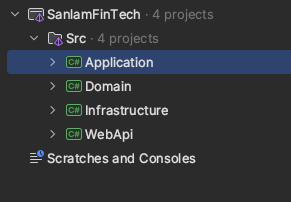

**Architecture and Project structure**

*Domain*
This layer contains the core business logic and entities

*Application*

This layer orchestrates application use cases, interacting with the Domain layer and defining interfaces that other layers implement. It handles application logic without knowing specifics of external systems, maintaining separation of concerns.

*Infrastructure*

This layer provides implementations for interfaces defined in the Application layer, such as database access. It depends on both the Domain and Application layers, enabling it to work with business entities and application logic.

*WebAPI*

This layer is the entry point for clients and handles HTTP requests and responses. It depends on the Application layer for executing business use cases and Infrastructure for dependency injection. It remains focused on presentation concerns, like managing controllers and formatting responses.

The below diagram shows the structure of the application

*Running the Application*

- Navigate to the root folder 
- Run docker compose up 
- Run dotnet restore && dotnet build && dotnet run --project Src/WebApi/WebApi.csproj

